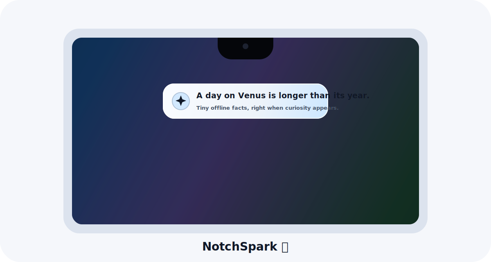

# ✨ NotchSpark

> A tiny, beautiful macOS notch companion that turns mouse moments into quick bursts of curiosity.

[](https://www.apple.com/macos/)
[](https://swift.org/)
[](#privacy-first)
[](LICENSE)
[](https://github.com/IbraheemGanayim/NotchSpark/releases/latest)

NotchSpark is a native macOS menu-bar app for MacBooks with a notch. Glide your cursor near the notch and a compact animated bubble appears with a short, fun, offline fact. It is minimal, fast, private, and designed to make your Mac feel a little more alive.

<p align="center">
  
</p>

## 🌟 Why People Love It

- 🎯 **Notch-native**: the popup is anchored around the MacBook notch instead of floating randomly.
- 🧠 **Tiny knowledge sparks**: quick facts that are short enough to enjoy without breaking focus.
- 🎨 **Adaptive contrast**: the popup chooses a high-contrast light or dark treatment from what is behind it when macOS allows sampling, then falls back to a safe readable style without surprise permission prompts.
- 🔒 **Privacy-first**: facts are bundled offline; no accounts, no analytics, no network calls.
- ⚡ **Lightweight**: built with Swift, AppKit, and SwiftUI.
- 🪄 **Delightfully minimal**: menu-bar only, no Dock clutter.

## 🚀 Install

### Option 1: Download The App

1. Download `NotchSpark.zip` from the [latest release](https://github.com/IbraheemGanayim/NotchSpark/releases/latest).
2. Unzip it.
3. Move `NotchSpark.app` to your `Applications` folder.
4. Open it and look for the sparkle icon in your menu bar.

If macOS says the app is from an unidentified developer, right-click `NotchSpark.app`, choose **Open**, then confirm. A signed and notarized release is on the roadmap.

### Option 2: Clone And Install

```sh
git clone https://github.com/IbraheemGanayim/NotchSpark.git
cd NotchSpark
Scripts/install_app.sh
```

That builds NotchSpark, installs it to `~/Applications/NotchSpark.app`, and launches it.

### Option 3: Build And Run Locally

```sh
git clone https://github.com/IbraheemGanayim/NotchSpark.git
cd NotchSpark
Scripts/build_app.sh
open .build/NotchSpark.app
```

### Option 4: Developer Mode

```sh
swift run NotchSpark
```

Running from source is useful for development. The app hides its Dock icon, but the **Launch at Login** menu item works best from an installed app bundle.

## 🕹️ How To Use

1. Launch NotchSpark.
2. Look for the sparkle icon in your macOS menu bar.
3. Move your cursor close to the notch or top-center of the screen.
4. Enjoy a small fact, then keep flowing.

From the menu-bar icon you can:

- Toggle NotchSpark on or off.
- Show a fact immediately.
- Enable Launch at Login.
- Quit the app.

## 🔐 Privacy First

NotchSpark is intentionally quiet:

- No network requests.
- No analytics.
- No tracking.
- No Accessibility permission.
- No Input Monitoring permission.

For adaptive contrast, NotchSpark uses macOS screen sampling only if access is already available. If it is not available, the app falls back to a high-contrast dark popup and keeps going.

## 🧪 Test

```sh
swift test
swift build
```

The test suite covers notch geometry, multi-display positioning, fact rotation, trigger cooldown, and contrast style selection.

## 🛠️ Requirements

- macOS 13 or newer
- Xcode command line tools or Xcode
- Swift 5.9+

## 💡 Feature Ideas Welcome

Got an idea that would make NotchSpark more delightful? Open an issue or send a PR. Good additions could be:

- More curated fact packs
- User-selectable fact themes
- Tiny sound or haptic-style animation options
- A signed release build
- Homebrew Cask support
- More languages

## 👋 Creator

Made with care by **Ibraheem Ganayim**.

- 🌐 Website: [ibraheemganayim.com](https://www.ibraheemganayim.com/)
- 🐙 GitHub: [@IbraheemGanayim](https://github.com/IbraheemGanayim)
- 📬 Email: [ganayim.ibraheem@gmail.com](mailto:ganayim.ibraheem@gmail.com)

If NotchSpark makes your Mac feel a little more fun, a ⭐ on GitHub helps more people discover it.
